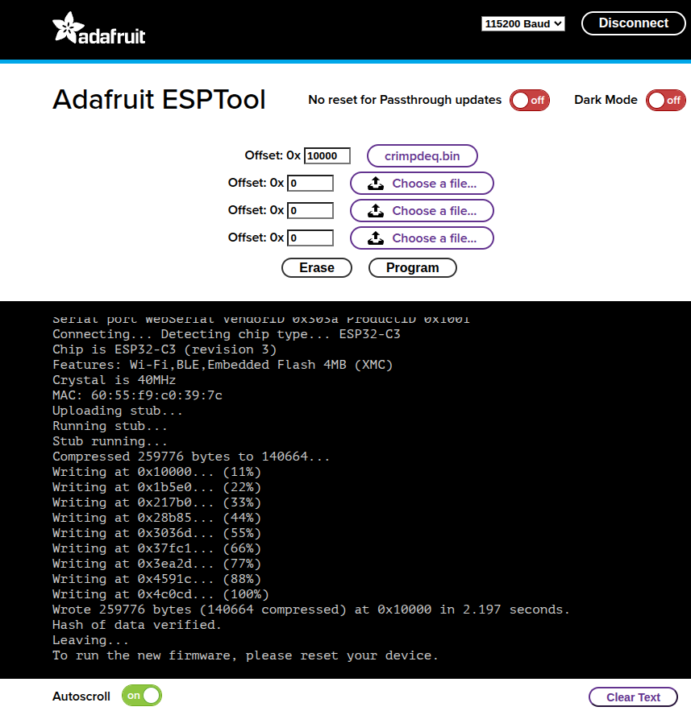

# Making Your Own Crimpdeq

This chapter explains how to build your own Crimpdeq prototype.

## 1. Required Materials
- [ESP32-C3-DevKit-RUST-1](https://github.com/esp-rs/esp-rust-board?tab=readme-ov-file#where-to-buy)
   - Other ESP32 boards can be used, but you will need a way to charge the battery.
- [Battery Holder](https://www.aliexpress.com/item/1005006283753220.html)
- [18650 Battery](https://www.aliexpress.com/item/1005007923191656.html)
   - Other batteries might also work, as long as they can power the device.
- [Crane Scale](https://www.aliexpress.com/item/1005002719645426.html) or [Amazon alternative](https://www.amazon.es/dp/B08133JCM6)
   - Other crane scales might also work.
- HX711 module:
   - [Amazon](https://www.amazon.es/dp/B0DJX8BPQL)
   - [AliExpress](https://www.aliexpress.com/wholesale?SearchText=HX711+module)
- [Optional] Resistors:
   - 1× 33 kΩ resistor
   - 1× 10 kΩ resistor

## 2. Disassemble the Crane Scale

1. Desolder the battery connections.
2. Desolder the four wires of the load cell (`E-`, `S-`, `S+` and `E+`) from the PCB.
   
3. Unscrew and remove the PCB along with the display.

## 3. Soldering
1. Modify the HX711 module:
   1. Set the sample rate to 80 Hz: Most HX711 modules ship with the `RATE` pin tied to `GND`, which sets a 10 Hz sample rate. To switch to 80 Hz:
      
      1. Cut the PCB trace to the `RATE` pin.
         - This can be done by carefully scratching the trace with a knife.
      2. Verify with a multimeter that `GND` and `RATE` are no longer connected.
         - Take care not to damage adjacent traces.
      3. Solder the `RATE` pin to the `DVDD` pin.
      4. Verify with a multimeter.
   2. [Optional] Optimize measurements for 3.3 V: Most HX711 modules are configured for 5 V operation. To improve measurements at 3.3 V:
      1. Solder, in parallel, a resistor between 20 kΩ and 27 kΩ across `R1`. `R1` is the highlighted resistor in the image:
      
      - For more information, see [this blog post](https://en.kohacraft.com/archives/modify-the-circuit-of-the-hx711-module-to-operate-at-3-3v-and-measure-the-weight-with-esp32.html).
      - This step is optional, but it improves measurement quality.
2. Connect the Load Cell to the HX711:
   - Solder the 4 wires from the crane scale to the HX711. Typical color mapping:

   | **HX711 Pin** | **Load Cell Pin** | **Description**                    |
   | ------------- | ----------------- | ---------------------------------- |
   | E+            | E+ (Red)          | Excitation positive (to load cell) |
   | E-            | E- (Black)        | Excitation negative (to load cell) |
   | S+            | S+ (Green)        | Signal positive (from load cell)   |
   | S-            | S- (White)        | Signal negative (from load cell)   |

    > ⚠️ **Note**: on some HX711 modules the `S+`/`S-` pins are labeled `A+`/`A-`.
3. Connect the HX711 to the ESP32-C3-DevKit-RUST-1:

| **HX711 Pin** | **ESP32-C3 Pin** | **Description**                |
| ------------- | ---------------- | ------------------------------ |
| VCC           | 3.3V             | Power supply (3.3V)            |
| GND           | GND              | Ground                         |
| DT (Data)     | GPIO4            | Data output from HX711         |
| SCK (Clock)   | GPIO5            | Clock signal for communication |


4. [Optional] Solder the voltage divider:
   1. Solder one end of the 33kΩ resistor to the `B+` pin on the ESP32-C3-DevKit-RUST-1.
   2. Join the other end of the 33kΩ resistor and one end of the 10kΩ resistor together, and connect that junction to `GPIO1` on the ESP32-C3-DevKit-RUST-1.
   3. Solder the remaining end of the 10kΩ resistor to `GND`.
   - The firmware expects the battery sense on `GPIO1` by default. Adjust the firmware configuration if you wire a different pin.
5. Verify all connections with a multimeter.

## 4. Adapt the Scale Case
1. Create space for the USB connector.
      - For example: place the board to mark the opening with a pen, then carefully heat a knife and melt the plastic to create space.
2. Install the battery holder:
   1. Glue the battery holder with silicone. Leave the lid for the scale’s original batteries open, you will route the two battery holder wires through that opening.
   2. Solder the positive wire (red) of the battery holder to a switch or button to turn the device on/off, then solder the other pin of the switch/button to the `B+` pin of ESP32-C3-DevKit-RUST-1.
   3. Solder the negative wire (black) of the battery holder to the `B-` pin of the ESP32-C3-DevKit-RUST-1.
3. Close the case:
   1. Ensure all components are securely installed before closing the case.


## 5. Upload the firmware
1. Connect your device with a USB‑C cable.
2. Pull the `crimpdeq-firmware` repository:
      ```bash
      git clone https://github.com/crimpdeq/crimpdeq-firmware
      ```
      If you don't have git installed, you can click the green "Code" button on the repository and use the "Download ZIP" option.
3. Upload the firmware to your device:
   1. Download the binary from the desired [GitHub releases](https://github.com/crimpdeq/crimpdeq-firmware/releases).
   2. Flash your device
     - Using [esp.huhn.me](https://esp.huhn.me/).
       1. Click "Connect" and select the serial port of your ESP board.
       2. Upload your `.bin` file.
       3. Click "Program".
         - See [this blog post](https://blog.spacehuhn.com/espwebtool) for more details.
     - Using [Adafruit ESPTool](https://adafruit.github.io/Adafruit_WebSerial_ESPTool/)
        1. Click Connect and select the serial port of your ESP board (should be named `USB/JTAG serial debug unit...`)
        2. Upload your `.bin` file at offset `0x10000`
        3. Click Program
 

   > ⚠️ **Note**: If this uploading method doesn't work for you, refer to the [Firmware chapter](firmware.md). You may need to install the prerequisites, build, and flash the firmware.
4. Check whether the default calibration values work for your scale:
   1. Connect your device with the Frez or Tindeq apps.
   2. Use the "Live View" option.
   3. Measure a known weight and verify that Crimpdeq measures the right value.
      - If Crimpdeq calibration is off, see the [Calibration chapter](calibration.md).
