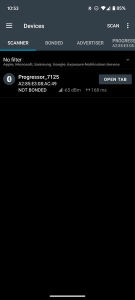
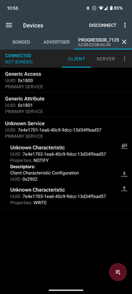
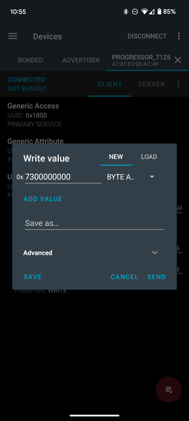

# Calibration

This guide will help you calibrate your Crimpdeq device to ensure accurate weight measurements. The calibration process involves using a known weight to establish a reference point for the device's measurements.

## Prerequisites
- nRF Connect installed for your platform:
  - [Android](https://play.google.com/store/apps/details?id=no.nordicsemi.android.mcp&hl=es_419)
  - [iOS](https://apps.apple.com/es/app/nrf-connect-for-mobile/id1054362403)
  - [Desktop](https://www.nordicsemi.com/Products/Development-tools/nRF-Connect-for-Desktop/Download#infotabs) (Windows, Linux, macOS)
- A stable mounting point so the device hangs freely and remains still
- One known weight (ideally near your typical maximum load)

## Calibration Steps

1. Connect to Crimpdeq with nRF Connect:
   1. Launch the app and go to the Scanner tab.
   2. Find the device named "Progressor_7125" and tap "Connect".
   3. Once connected, the app will display the device’s services and characteristics.  
      
2. Locate the calibration characteristic:
   1. Expand the "Unknown Service" section.
   2. Find the characteristic with UUID: `7e4e1703-1ea6-40c9-9dcc-13d34ffead57`.  
      
3. Compute the hex value of your known weight:
   1. Open the [Floating Point to Hex Converter](https://gregstoll.com/~gregstoll/floattohex/).
   2. Select "Single-precision" (32-bit) floating point.
   3. Enter your known weight in the "Float value" field (in kilograms unless your device expects grams; see Important Notes).
   4. Click "Convert to hex" and save the resulting "Hex value".  
      **Example:** 75.3 kg → `0x4296999a`.
4. Zero the device (tare):
   1. Hang Crimpdeq with no weight attached.
   2. Send the command `7300000000` to the characteristic:
      - Tap the Up Arrow icon on the characteristic (`7e4e1703-1ea6-40c9-9dcc-13d34ffead57`).
      - Enter the command as shown.  
        
5. Perform the calibration:
   - Commands and values are hex strings without spaces (letter case does not matter).
   1. Attach your known weight to Crimpdeq.
   2. Build the calibration command by prefixing `73` to your hex value.
      - **Example:** For 75.3 kg (`0x4296999a`), send: `734296999a`.
   3. Send this command to the same characteristic (`7e4e1703-1ea6-40c9-9dcc-13d34ffead57`).
6. Verify:
   1. Remove the weight and reattach it.
   2. The reported value should be within a small tolerance of the known weight. If not, repeat steps 4–5.

## Important Notes
- Units: Some devices expect the calibration value in grams instead of kilograms. If, after calibration, the measured value looks off by a factor of ~100 (e.g., 75.3 kg shows ~0.75), convert your known weight to grams and repeat step 5.
- Use a weight close to the maximum load you expect to measure (while staying within device limits) for best accuracy.
- Ensure the device is stable and stationary when sending commands.
- Perform calibration in a controlled environment (avoid wind, vibration, and temperature swings).

