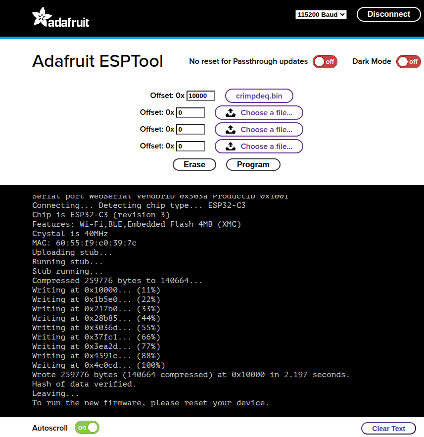

# Firmware
The firmware application is written in asynchronous Rust (`no_std`) using `esp-hal` along with some ancillary crates.

## Prerequisites

To build and upload the firmware to your device, ensure you have the following installed:
- Rust: See [installation](https://rustup.rs/) for details
- The `stable` toolchain with the ESP32-C3 target architecture installed:
  ```bash
  rustup toolchain install stable --component rust-src --target riscv32imc-unknown-none-elf
  ```
- [`probe-rs`](https://probe.rs/) installed, see [instructions](https://probe.rs/docs/getting-started/installation/)
- OS notes:
  - Linux: set up udev rules for your debug probe or USB‑Serial device (see [`probe-rs` udev guide](https://probe.rs/docs/getting-started/installation/#udev-rules)).
  - Windows/macOS: ensure the correct USB drivers are installed and select the appropriate serial port in your tooling.

## How to Build
To build the firmware, run:
```bash
cargo build --release
```
To build and upload the firmware to your device, refer to the [Build and Flash your Device](#build-and-flash-your-device) section.

## How to Flash your Device

### Erase your Device Memory
If you used the device for other projects, you need to erase the memory of the device:
```bash
probe-rs erase
```

This only needs to be done once, after that, you should only flash the firmware without erasing the memory. Otherwise, you will lose your [calibration values](./calibration.md).

### Build and Flash your Device
Since we've set a [custom runner](https://doc.rust-lang.org/cargo/reference/config.html#targettriplerunner) in the `.cargo/config.toml`, you can build and upload the resulting binary to your target using:
```bash
cargo run --release
```
This will also open a serial monitor, allowing you to view log messages in real time.

To modify the [log level](https://defmt.ferrous-systems.com/filtering), update the `DEFMT_LOG` value in `.cargo/config.toml` or set it when running the command:
```bash
DEFMT_LOG=debug cargo run --release
```

> ⚠️ **Note**:  If you're using a different DevKit that doesn't include USB-Serial-JTAG, you'll need to flash the device via UART. This requires updating the custom runner in `.cargo/config.toml` and using [`espflash`](https://github.com/esp-rs/espflash/tree/main/espflash#cargo-runner) instead of `probe-rs`.

### Flashing From Your Browser
This method does not require any of the [Prerequisites](#prerequisites), but also it does not allow modifying the code. Instead, it only allows flashing a [released firmware version](https://github.com/crimpdeq/crimpdeq-firmware/releases).

To flash the released binary using your browser:
1. Download the binary from the desired GitHub release
2. Open [Adafruit ESPTool](https://adafruit.github.io/Adafruit_WebSerial_ESPTool/)
3. Click Connect and select the serial port of your ESP board (should be named `USB/JTAG serial debug unit...`)
4. Upload your .bin file(s) at offset 0x`10000`
5. Click Program
  

## Code Structure
### `hx711`
This module implements the load cell functionality, it's an `async` version of the [loadcell](https://crates.io/crates/loadcell) crate with additional modifications.
### `ble`
This module implements the Bluetooth Low Energy (BLE) functionality:
- Defines the GATT server and services
- Handles advertising and connections
- Defines the Progressor service with data point and control point characteristics
### `progressor`
The `progressor` module implements the [Tindeq API](https://tindeq.com/progressor_api/), enabling BLE (Bluetooth Low Energy) communication between the ESP32-C3 and a smartphone.
## Main Tasks
The `main.rs` file defines several asynchronous tasks that run concurrently:
- `measurement_task`:
  - Initializes the load cell
  - Handles taring and reading measurements from the sensor.
- `ble_task`:
  - This is a background task that is required to run forever alongside any other BLE tasks.
- `gatt_events_task`:
  - Processes GATT events like control point writes
- `data_processing_task`:
  - Handles sending notifications with data points

Communication between tasks occurs via a [`Channel`](https://docs.embassy.dev/embassy-sync/git/default/channel/struct.Channel.html).
